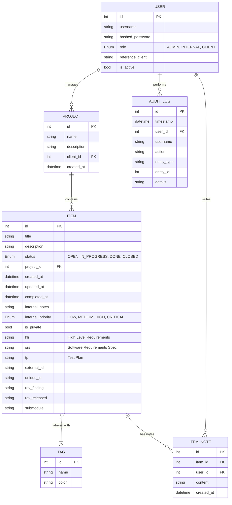

# Schema Database IcebergPM 🧊

Questo documento illustra l'architettura dei dati dell'applicazione IcebergPM, evidenziando le entità principali e le loro interconnessioni.

## Diagramma Entità-Relazione (ER)

## Descrizione delle Entità

### 👤 Users
Gestisce l'autenticazione e l'autorizzazione.
- **Ruoli**: Determinano l'accesso alle funzionalità (es. gli utenti `CLIENT` vedono solo i propri progetti).
- **Reference Client**: Un campo opzionale per raggruppare gli utenti sotto uno specifico cliente.

### 📂 Projects
Contenitori logici per i task. Ogni progetto è assegnato a un "cliente" (User).

### 📋 Items (Tasks)
L'entità centrale dell'applicazione. Supporta:
- **Lifecycle**: Tracciamento tramite `created_at`, `updated_at` e `completed_at`.
- **Tracciabilità**: Campi specifici per requisiti tecnici (`hlr`, `srs`, `tp`).
- **Privacy**: Flag `is_private` per nascondere i dettagli tecnici agli utenti esterni.

### 🏷️ Tags
Etichette colorate che possono essere applicate a più Item per facilitare il filtraggio. La relazione è molti-a-molti tramite la tabella `item_tags`.

### 💬 Item Notes
Conversazioni e annotazioni relative a un task. Permettono la tracciabilità degli aggiornamenti con l'indicazione dell'autore e dell'orario di inserimento.

### 🛡️ Audit Logs
Registro immutabile di tutte le operazioni critiche (creazione, modifica, eliminazione) per garantire la sicurezza e la tracciabilità delle modifiche.

> [!NOTE]
> Lo schema è implementato utilizzando **SQLAlchemy** su **SQLite** in modalità sviluppo. I timestamp sono gestiti automaticamente per garantire precisione e integrità.
